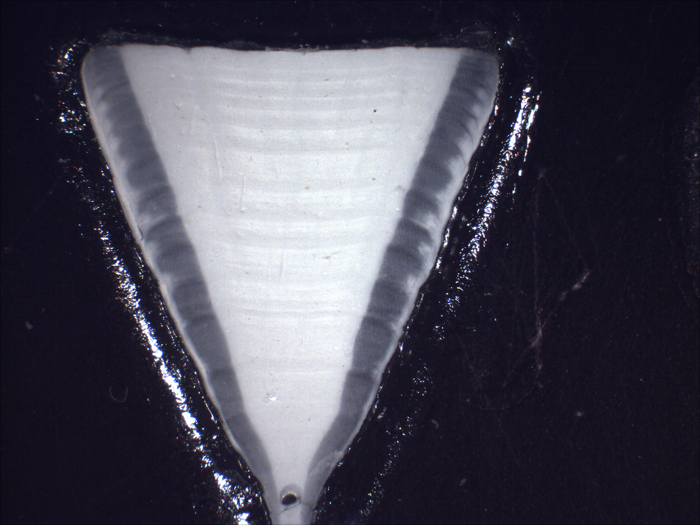

```{r setup, include=FALSE}
source("../analysis/load_results.R")

tl_pcl <- with(data, lm(STL ~ PCL))
```

## Length-length relationships
The relationships among total length (TL), fork length (FL), and pre-caudal length (PCL) in *C. limbatus* for sexes combined were: $$TL = 1.600 + 1.224 \cdot FL \quad (\textup{ANOVA}: F = 138323, df = 1, 469, p < 0.001) $$ $$TL = 4.206 + 1.340 \cdot PCL \quad (\textup{ANOVA}: F = 33643, df = 1, 295, p < 0.001)$$

## Depth at capture
```{r, figS1, fig.width = 5, fig.height = 3}
p <- ggplot(data, aes(x = Depth, y= STL, fill = Sex)) + geom_point(shape = 21) + xlab("Depth (m)") + 
  ylab("TL (cm)") + scale_fill_manual(values = c("#E1AF00","#3B9AB2")) +  
  guides(fill = guide_legend(title = NULL)) + lim_theme
p
```
\
Fig S1. Depth at capture for male and female *C. limbatus* from New South Wales waters. 

\newpage

## Age and growth


\
Fig. S2. Vertebrae section from a 216 cm male *C. limbatus* with 15 growth zone pairs

\newpage

```{r, figS3, fig.width = 4, fig.height = 4}
age_bias <- ageBias(Reader1 ~ Reader2, floor(age))
plot(age_bias)
```

\
Fig. S3. Age bias plot showing mean age (plus and minus 95% confidence intervals) of Reader 1 relative to those of Reader 2. Sample size of each age class is denoted at the top of the graph.

\newpage

## Clasper length
The male maturation process was investigated by modelling the development of clasper length, CL, as a function of length using a modified logistic regression equation $$ CL(l_i) = f + (g-f)[1+e^{-ln(19)\frac{l_i - CL_{50}}{CL_{95}-CL_{50}}}]^{-1}\cdot e^{\epsilon} \quad \quad \epsilon \sim N(0,\sigma^2)$$ where *f* and *g* are parameters that determine the slope and intercept, and $CL_{50}$ and $CL_{95}$ are the lengths at which claspers are 50% and 95% of their maximum length. The relationship also has a practical purpose as CL is a useful characteristic for species identification [@stevens_biology_1986; @harry_comparison_2012]. 

```{r, figS4, fig.width = 8, fig.height = 3.5}

p <- ggplot(filter(plot_data_both, Species %in% "C. limbatus"), aes(x = STL, y = Clasp.length)) + 
  geom_ribbon(aes(ymin = p.lower, ymax = p.upper), fill = "grey80") + 
  geom_ribbon(aes(ymin = c.lower, ymax = c.upper), fill = "grey60") +  
  geom_line() + facet_wrap(~ cl_facet) +
  geom_point(data = data_all, aes(x = STL, y = Clasp.length, fill = Species), shape =21)  + 
  scale_fill_manual(values = c("#E1AF00","#3B9AB2")) + xlab("TL (cm)") +
  ylab("Clasper length (mm)")+theme(legend.position=c(.2,.80),
  legend.text = element_text(face = "italic", size = rel(0.75))) + 
  ylim(0, 290) +
  lim_theme

p1 <- ggplot(plot_data_both, aes(x = STL, y= Clasp.length, linetype = Species)) + geom_line() +
  scale_linetype_manual(values = c("solid","dashed")) + theme(legend.position=c(.2,.80),
  legend.text = element_text(face = "italic", size = rel(0.75))) +
  ylim(0, 290) + ylab("") + xlab("TL (cm)") + facet_wrap(~ facet) + lim_theme

grid.arrange(p, p1, nrow = 1)
```

\
Fig. S4. Clasper length as a function of length for male *C. limbatus*. Panel (a) shows non-linear regression model with 95% confidence and prediction intervals for *C. limbatus*. Points are empirical clasper lengths for *C. limbatus* and Qld *C. tilstoni*. Panel (b) compares the mean relationship between the two species. 

## Demographic analysis
This section describes aspects of the Monte Carlo simulation used to investigate sources of uncertainty in the demographic analysis, including areas where the approach for a specific species / stock deviates from the general approach described in the methodology. 

### Growth parameters
Growth parameters for *C. tilstoni* populations based on vertebral ageing were similar [@davenport_age_1988; @harry_age_2013], although in both cases they were clearly biased as a result of uncorrected effects of gillnet selectivity. For Qld *C. tilstoni*, a logistic function was chosen to model length at age as the estimated $L_\infty$ was closer to observed maximum length of the species. In the original analysis by Harry *et al.* [-@harry_age_2013], this model was fit with a lognormal variance, and this led to unstable parameter estimates when attempting to resample random parameters from the variance-covariance matrix. To provide more reasonabe values for the Monte Carlo simulation the model was refit with normal variance. For NT *C. tilstoni*, growth parameters estimated from size mode analysis were ultimately chosen in favor of those from vertebral ageing as, again, they were closer to observed maximum length of the species [@davenport_age_1988]. Because the original data were not available, growth parameters were randomly resampled from a normal distribution with a CV of 5%. 

### Weight at length
No resampling was undertaken on the weight-length parameters for NT *C. tilstoni* due to the lack of raw data for this species. 

### Maturity at length
For NT *C. tilstoni* uncertainty in reproductive output at age was incorporated by allowing the maternity ogive to shift horizontally over a range of values by adding a constant to $A_{50}$ and $A_{95}$. Constants were drawn from a random normal distribution with a variance of 0.5 years (10% of $A_{50}$). The 95% quantiles of random $A_{50}$ values ultimately used in the Monte Carlo simulation were 4.03 to 5.98 years. 

### Fecundity
For NT *C. tilstoni* values of fecundity were drawn from a normal distribution with a mean of 3 [@stevens_biology_1986] and a CV of 10%. For *C. limbatus* values of fecundity were randomly resampled with replacement from a vector of mean fecundity values including this and four other studies [@white_catch_2007; @capape_reproductive_2004 ;@bass_sharks_1973; @dudley_sharks_1993]. 

### Natural mortality
*M* was calculated using a constant, size-based method [@then_evaluating_2015] that required growth parameters $L_\infty$ and *K* from the von Bertalanffy equation. This presented a problem for Qld *C. tilstoni* where a logistic growth model was used to model growth. Using the values of $L_\infty$ and *K* from the von Bertalanffy model in Harry *et al.* [-@harry_age_2013] was also deemed unsuitable because they were strongly biased, and led to unrealistically small values of *M*. To address this problem, a von Bertalanffy growth function was re-fit to the length at age data in Harry *et al.* [-@harry_age_2013], constraining $L_\infty$ to the value in the logistic growth curve. As per *C. limbatus* and *C. tilstoni*, values of $L_\infty$ and *K* used to derive *M* for the Monte Carlo simulation were then resampled from a multivariate normal distribution with a mean and covariance matrix obtained from this constrained model. Noting the high level of uncertainty in *M*, for each simulation additional variability was added to the calculated value of *M*, drawn from a random normal distribution with a CV of 20% of *M*. 

\newpage


## Additional discussion points on the ecology of central eastern Australia *C. limbatus*
The ecology of *C. limbatus*, like its life history, has historically been confounded by its co-occurrence and hybridisation with *C. tilstoni*. Large, adult *C. limbatus*, which are clearly separable from *C. tilstoni* have been reported in small numbers throughout northern Australia [@stevens_biology_1986; @salini_northern_2007; @johnson_novel_2017]. Neonate *C. limbatus*, also easily separable [@harry_comparison_2012], have been reported from communal shark nursery areas on both the east and west coasts of Australia [@simpfendorfer_utilisation_1993; @white_habitat_2004; @gutteridge_community_2011; @taylor_size_2013; @yates_spatio-temporal_2015].

Although the species occurs throughout northern Australia, data from this study indicate that the central east coast of Australia might be an area of higher relative abundance for *C. limbatus*. Taylor *et al.*'s [-@taylor_size_2013] study of the shark fauna of Moreton Bay showed *C. limbatus* to be one of the most commonly caught sharks, suggesting the area would likely meet the formal criteria needed to be classified as a nursery *sensu* Heupel *et al.* [-@heupel_shark_2007]. In this study we assumed the neonates in Moreton Bay were part of the same population as those larger sharks sampled off northern NSW. This is not known definitively, but is a reasonable assumption given the absence of any other reported parturition areas for *C. limbatus* to the south and the absence of adults from within Moreton Bay itself [@taylor_size_2013]. Nine small (73 - 83 cm) sharks were also captured during January and February in 2008 and 2009 from 7m depth off Woody Head ($29^\circ 20'S, 153^\circ 21'E$). Although they were not examined for the presence of an umbilical scar, all were aged as 0+ and were therefore likely to have been no more than a few months old. These individuals provide possible evidence that *C. limbatus* parturition might also occur in NSW waters. 

Little is known about the spatial ecology of *C. limbatus* or potential linkages between individuals from the central east coast of Australia in the present study, and those individuals found in tropical waters further north. Welch *et al.* [-@welch_stock_2010] investigated the stock structure of *C. limbatus* off the east coast and identified two management units separated by the Tropic of Capricorn. Macbeth *et al.* [-@macbeth_observer-based_2009] also found potential evidence of a seasonal migration in *C. limbatus*, with the species predominantly caught between January and June. This suggests a potential northward seasonal migration during part of the year. Such behaviour would be consistent with that of some other large carcharhinid sharks [@braccini_dusky_Inpress] including populations of *C. limbatus* in the northwest Atlantic and southwest Indian Ocean [@dudley_sharks_1993; @kajiura_quantification_2016]. 

In keeping with previous studies on hybridisation, no evidence of intermediate types was found in this study among hybrid sharks [@harry_comparison_2012; @johnson_novel_2017]. All hybrid individuals showed biological characteristics that were macroscopically similar to that of purebred *C. limbatus*. The single purebred *C. tilstoni* identified from NSW using nDNA was a 145cm female captured from a depth of ~ 42m near the mouth of the Clarence River, NSW ($29^\circ 32.99'S, 153^\circ 25.48'E$). This is the southernmost record confirmed for this species (excluding individuals with hybrid ancestry identified solely using mtDNA). The previous southernmost record was a juvenile *C. tilstoni* from Moreton Bay identified using a pre-caudal vertebral count [@harry_comparison_2012]. 

## References